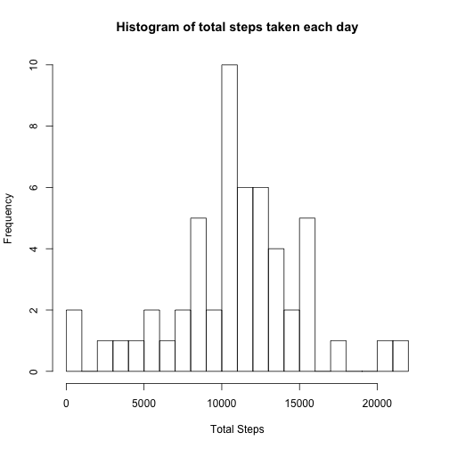
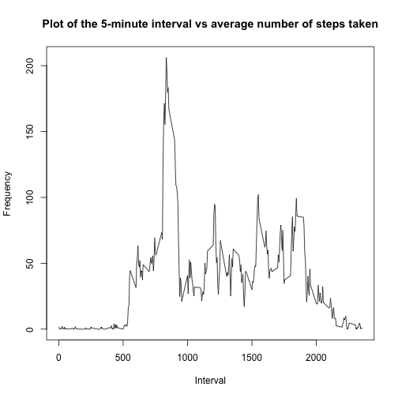
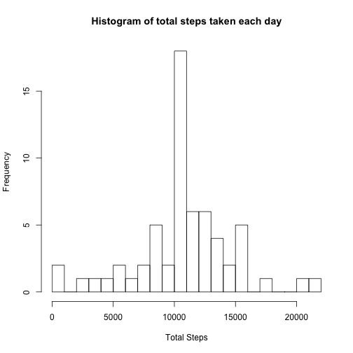
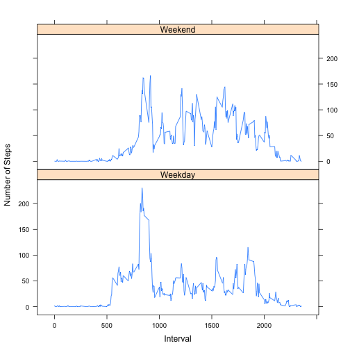

## Loading and preprocessing the data

```r
mydata <- read.csv("activity.csv")
mydata3 <- data.matrix(mydata)
```

## What is mean total number of steps taken per day?
###Calculate the total number of steps taken per day

```r
# ignore NA's
mydata2 <- na.omit(mydata)
# Calculate the total number of steps taken per day
total_steps <- aggregate(x = mydata2$steps,
                         FUN = sum,
                         by = list(mydata2$date))
colnames(total_steps) = c("Date", "total_steps")

cat ("The total steps taken is")
```

```
## The total steps taken is
```

```r
total_steps
```

```
##          Date total_steps
## 1  2012-10-02         126
## 2  2012-10-03       11352
## 3  2012-10-04       12116
## 4  2012-10-05       13294
## 5  2012-10-06       15420
## 6  2012-10-07       11015
## 7  2012-10-09       12811
## 8  2012-10-10        9900
## 9  2012-10-11       10304
## 10 2012-10-12       17382
## 11 2012-10-13       12426
## 12 2012-10-14       15098
## 13 2012-10-15       10139
## 14 2012-10-16       15084
## 15 2012-10-17       13452
## 16 2012-10-18       10056
## 17 2012-10-19       11829
## 18 2012-10-20       10395
## 19 2012-10-21        8821
## 20 2012-10-22       13460
## 21 2012-10-23        8918
## 22 2012-10-24        8355
## 23 2012-10-25        2492
## 24 2012-10-26        6778
## 25 2012-10-27       10119
## 26 2012-10-28       11458
## 27 2012-10-29        5018
## 28 2012-10-30        9819
## 29 2012-10-31       15414
## 30 2012-11-02       10600
## 31 2012-11-03       10571
## 32 2012-11-05       10439
## 33 2012-11-06        8334
## 34 2012-11-07       12883
## 35 2012-11-08        3219
## 36 2012-11-11       12608
## 37 2012-11-12       10765
## 38 2012-11-13        7336
## 39 2012-11-15          41
## 40 2012-11-16        5441
## 41 2012-11-17       14339
## 42 2012-11-18       15110
## 43 2012-11-19        8841
## 44 2012-11-20        4472
## 45 2012-11-21       12787
## 46 2012-11-22       20427
## 47 2012-11-23       21194
## 48 2012-11-24       14478
## 49 2012-11-25       11834
## 50 2012-11-26       11162
## 51 2012-11-27       13646
## 52 2012-11-28       10183
## 53 2012-11-29        7047
```
### Histogram of the total number of steps taken each day

```r
hist(total_steps$total_steps, breaks = 30, xlab = "Total Steps", ylab = "Frequency", main = "Histogram of total steps taken each day" )
```

 
### Calculate and report the mean and median of the total number of steps taken per day

```r
cat ("The mean of total number of steps taken per day is equal to ", mean(total_steps$total_steps))
```

```
## The mean of total number of steps taken per day is equal to  10766.19
```

```r
cat ("The median of total number of steps taken per day is equal to ", median(total_steps$total_steps))
```

```
## The median of total number of steps taken per day is equal to  10765
```

## What is the average daily activity pattern?
### Make a time series plot (i.e. type = "l") of the 5-minute interval (x-axis) and the average number of steps taken, averaged across all days (y-axis)


```r
avg_steps <- aggregate(x = mydata2$steps,
                       FUN = mean,
                       by = list(mydata2$interval))
plot(avg_steps$Group.1, avg_steps$x, type = "l", xlab = "Interval", ylab = "Frequency", main = "Plot of the 5-minute interval vs average number of steps taken")
```

 

### Which 5-minute interval, on average across all the days in the dataset, contains the maximum number of steps?

```r
get.rows   <- (avg_steps$x == max(avg_steps$x))
max_avg_steps <- avg_steps[get.rows,]
cat ("The 5-minute interval that contains the maximum number of steps is", max_avg_steps$Group.1)
```

```
## The 5-minute interval that contains the maximum number of steps is 835
```

```r
cat ("The number of steps taken during that duration is", max_avg_steps$x)
```

```
## The number of steps taken during that duration is 206.1698
```

```r
cat ("The time at that instant is", max_avg_steps$Group.1/100 )
```

```
## The time at that instant is 8.35
```


## Imputing missing values
### Calculate and report the total number of missing values in the dataset (i.e. the total number of rows with NAs)


```r
total_missing_values = nrow(mydata) - nrow(mydata2)
cat ("The total number of missing values is equal to ", total_missing_values)
```

```
## The total number of missing values is equal to  2304
```

### Devise a strategy for filling in all of the missing values in the dataset.


```r
## I will use the mean of the 5 minute interval to fill the missing values 
mean_steps <- aggregate(x = mydata2$steps,
                         FUN = mean,
                         by = list(mydata2$interval))
```

### Create a new dataset that is equal to the original dataset but with the missing data filledin 


```r
## The NA's are replaced by the mean of the interval they belong to 
for (i in 1:nrow(mydata3)){
  if(is.na(mydata[i,1,1])){
    get_r <- (mydata[i,,]$interval == mean_steps$Group.1)
     
     mdata <- mean_steps[get_r,]
     mydata3[i] <- mdata$x
  }
}
mydata3 <- data.frame(mydata3)
```

### Make a histogram of the total number of steps taken each day and Calculate and report the mean and median total number of steps taken per day

```r
total_steps_all <- aggregate(x = mydata3$steps,
                         FUN = sum,
                         by = list(mydata3$date))
colnames(total_steps_all) = c("Date", "total_steps")

hist(total_steps_all$total_steps, breaks = 30, xlab = "Total Steps", ylab = "Frequency", main = "Histogram of total steps taken each day")
```

 

```r
cat ("The mean of total number of steps (replacing NA's) taken per day is equal to ", mean(total_steps_all$total_steps))
```

```
## The mean of total number of steps (replacing NA's) taken per day is equal to  10766.19
```

```r
cat ("The median of total number of steps (replacing NA's) taken per day is equal to ", median(total_steps_all$total_steps))
```

```
## The median of total number of steps (replacing NA's) taken per day is equal to  10766.19
```

###  Do these values differ from the estimates from the first part of the assignment? What is the impact of imputing missing data on the estimates of the total daily number of steps?
The mean remained the same while the median increased by a negligible amount. The impact of inputting the missing data on the estimates of the total daily number of steps is negligible at best. 


## Are there differences in activity patterns between weekdays and weekends?
### Create a new factor variable in the dataset with two levels - "weekday" and "weekend" indicating whether a given date is a weekday or weekend day.

```r
mydata$date <- as.Date(mydata$date)
df1 <- NA

  for (i in 1:nrow(mydata)){
    df1[i] <- weekdays(mydata$date[i])
  }
mydata3["Day"] <- df1

df2 <- subset(mydata3, Day %in% c("Saturday", "Sunday"))
df3 <- subset(mydata3, Day %in% c("Monday", "Tuesday", "Wednesday", "Thursday", "Friday"))

avg_steps_weekday <- aggregate(x = df3$steps,
                         FUN = mean,
                         by = list(df3$interval))

avg_steps_weekend <- aggregate(x = df2$steps,
                               FUN = mean,
                               by = list(df2$interval))
avg_steps_weekday["Day_F"] <- "Weekday"
avg_steps_weekend["Day_F"] <- "Weekend"
avg_steps_allweek <- rbind(avg_steps_weekend,avg_steps_weekday)
```

###Make a panel plot containing a time series plot (i.e. type = "l") of the 5-minute interval (x-axis) and the average number of steps taken, averaged across all weekday days or weekend days (y-axis)

```r
library(lattice)
xyplot(avg_steps_allweek$x ~ avg_steps_allweek$Group.1|avg_steps_allweek$Day_F, layout = c(1,2), type="l", xlab = "Interval", ylab = "Number of Steps" )
```

 
